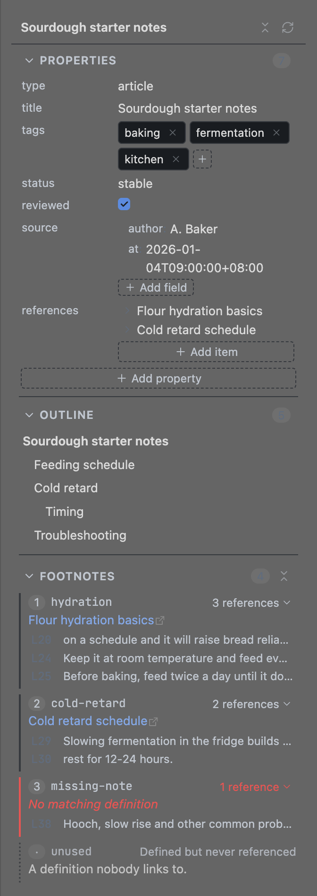
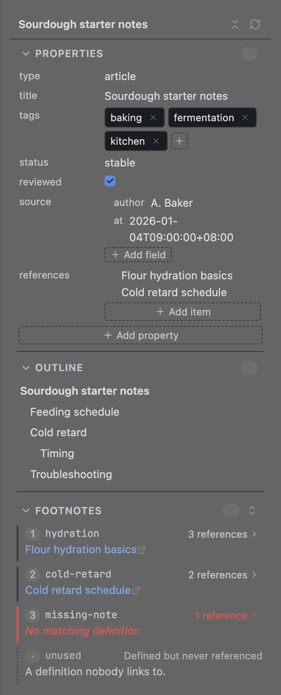

# Note Inspector

[English](README.md) | **简体中文**

把 Obsidian 内置的 **File properties（Frontmatter）**、**Outline**、**Footnotes** 三个视图合并到一个侧边面板里，跟随当前笔记；三个分区各自可以折叠，**面板会记住你的折叠选择**。

## 缘起

这个插件是在构建个人 **LLM Wiki** 的过程中长出来的。笔记按 **OKF（Open Knowledge Format）规范** 构建，frontmatter 因此是结构化的、而非随手写的：规范要求笔记记录自身的来源，`generated` 就用来标明内容由谁（哪个模型）生成、何时生成。再加上大纲和大量脚注，检查一篇笔记得在三个视图之间来回切换 —— 于是把三者合并进同一个面板。名字里的 *inspector* 即「检查器」：选中一篇笔记，像开发者工具的检查器那样给出它的**属性（attributes）、结构（hierarchy）、引用（references）**。

## 安装

需要 Obsidian **1.13.0** 或更高版本。

### 从插件市场

插件上架后，在 **设置 → 第三方插件 → 浏览** 里搜索 **Note Inspector** 安装。

### 手动安装

从 [latest release](https://github.com/xinthink/obsidian-note-inspector/releases) 下载 `main.js`、`manifest.json`、`styles.css`，放进 `<vault>/.obsidian/plugins/note-inspector/`，再到 **设置 → 第三方插件** 启用（需先关闭受限模式）。列表里没有就重载一次 Obsidian。

## 使用

面板在右侧边栏（或在命令面板运行 **Open note inspector**），跟随你正在编辑的笔记 —— 点击面板本身不会让内容消失。顶部是当前笔记名和两个按钮：**全部折叠/展开**、**刷新**。

### Properties（属性）

按 YAML 原始顺序显示笔记的 frontmatter，嵌套结构也会展开：

- 点值就地编辑（布尔值是勾选框），**Enter** 保存、**Esc** 取消。
- 普通数组（如 `tags`）是 chip：点 chip 改名、`×` 删除、`＋` 追加。对象数组（如 `references`）一行一条、点击展开，**`＋ Add item`** 按上一条的字段结构新增一条。
- **`＋ Add property`** 新建顶层属性（先选 **Text / List / Dict**）；字典里的 **`＋ Add field`** 加字段，空字典 `{}` 也能加。
- 值里的 `[[内链]]`、`[文字](链接)`、裸 URL 可以直接点开；点属性名在笔记里定位到那一行，悬停行尾可删除。
- 改属性和内置属性编辑器行为一致：Obsidian 可能重排整个 frontmatter 块（`tags: [a, b]` 可能变成块状列表）。复杂的手写 YAML 建议回笔记里改 —— 点属性名即可跳过去。

### Outline（大纲）

按 H1–H6 缩进的标题树，可设置最大层级。点标题跳到对应位置（源码模式移动光标，阅读模式滚动预览）。可选显示 `H1`–`H6` 标签，可选高亮光标所在章节的标题。

### Footnotes（脚注）

- 按引用顺序编号，显示脚注 id、定义正文（链接可点）与引用次数。
- **点定义正文直接编辑**：`⌘/Ctrl+Enter` 或 ✓ 保存（可 `⌘Z` 撤销），`Esc` 或 ✗ 取消，**清空内容即删除该定义**（含缩进续行）。只是点进去看看、没改动就不会保存。
- 默认只显示定义和引用次数；**点某条的「N references」** 查看它被引用的行，标题栏按钮可一次展开/收起全部。**展开的引用行重启 Obsidian 后恢复收起**；想默认就显示，打开设置里的 *Show footnote context*。
- 点脚注**编号或 id** 在编辑器里选中整条定义；点**某条引用行**选中那处 `[^id]`。
- 引用了但没定义的标红 *No matching definition*（点 `＋` 在文末补写定义）；定义了没人引用的标记 *Defined but never referenced*。定义过长折叠到 3 行，点 **Show more** 展开。

## 设置

| 设置 | 默认 | 说明 |
|---|---|---|
| Show item counts | 开 | 分区标题旁显示条目数量 |
| Outline depth | 6 | 大纲显示到第几级标题（H1–H6） |
| Show heading level badges | 开 | 大纲条目前显示 H1–H6 标签 |
| Highlight current heading | 开 | 高亮光标所在章节的标题（源码模式） |
| Show footnote context | 关 | 默认列出引用行；关闭时点「N references」临时查看 |
| References shown per footnote | 3 | 每条脚注最多显示的引用行数，超出折叠到「Show more」 |
| Reset panel state | — | 恢复默认设置与折叠状态 |

面板文案**跟随 Obsidian 的界面语言**（中文界面显示中文，其余英文），没有单独的语言选项。

## 须知

- 标题和脚注来自 Obsidian 的元数据缓存，停止输入后稍等片刻才刷新 —— 与内置 Outline 的表现一致。
- 插件只读写笔记的 frontmatter 和脚注行，不会改动笔记的其他部分，也没有任何网络请求、遥测或广告。

## 开发与设计

贡献流程见 [CONTRIBUTING.md](CONTRIBUTING.md)；面向维护者与 AI 代理的设计与实现说明见 [AGENTS.md](AGENTS.md)。

## License

MIT
